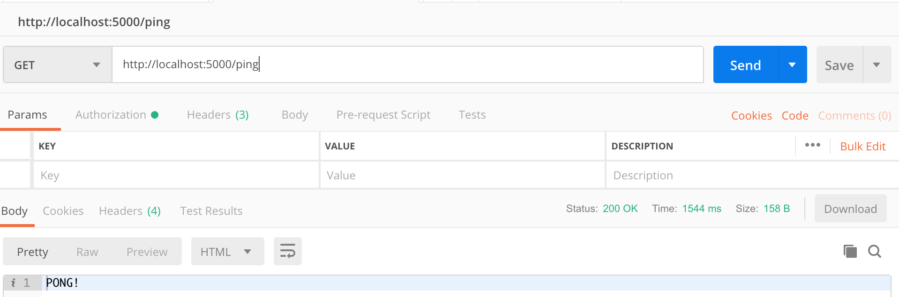
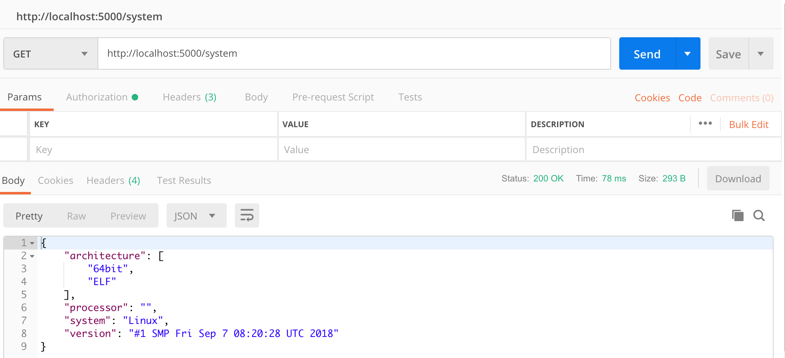
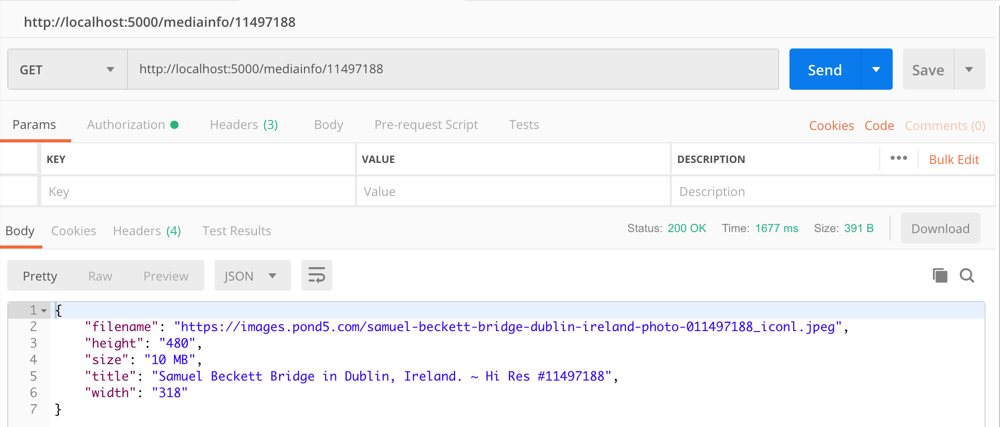

# Pond5_Test

A simple web service that will give information about a preview image from a Pond5 media item. Created using Python3 and Flask.
It takes a photo of the [Samuel Becket Bridge](https://www.pond5.com/photo/11497188) from pond5.com and return information on that photo
as well as system information and it pings the given address too and gives a response of 'pong'.

## Run Locally

You can run this code locally by cloning the repo into your current directory.

In the same directory in your terminal run
```bash
python app.py
```
To view in your browser, go to [localhost](http://localhost:5000/)

## Run via Docker

This application is available through Docker.

To pull the docker repo to your local machine you can use:
```bash
 docker pull davidodit/pond-test:firsttag
```

Then you can run it using:
```bash
docker run -d -p 5000:5000 pond-test:firsttag
```
## Questions and Testing

There was three main parts in this test which included:

1. GET /ping request should return “pong”.

2. GET /system request should return JSON object with service version and system information.

3. GET /mediainfo/<id> should return a JSON object with image filename, size, dimensions and image title.

After completion of these questions I tested the endpoints using Postman. You can test in Postman too or use your browser and navigate to localhost and port:5000.

Q.1


Q.2



Q.3



## Unit Tests

To run simple unit tests run the command:
```bash
python test_app.py
```
